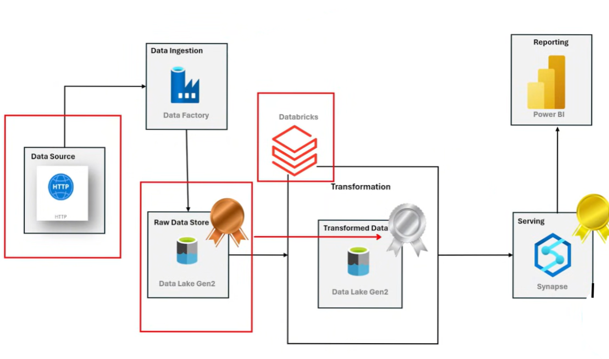

# Azure Data Engineering End-to-End Project  
## AdventureWorks Lakehouse using Medallion Architecture (Bronze → Silver → Gold)

**By Jeshwanth Premkumar**  
[](https://github.com/jazzjesh)  
[](https://linkedin.com/in/jeshwanth-premkumar)

---

## 🧰 **Technologies Used**


---

## 📌 Project Overview  
This project demonstrates a **complete, production-ready Azure Data Engineering Lakehouse Pipeline** using the **AdventureWorks** dataset.

### ✔ What this project includes:
- Automated ingestion using **Azure Data Factory**
- Raw → Clean transformation using **Azure Databricks (PySpark)**
- **Medallion Architecture**  
  - 🥉 Bronze → Raw  
  - 🥈 Silver → Clean  
  - 🥇 Gold → Serving / Star Schema
- Optimized storage in **ADLS Gen2 (Parquet)**
- **Synapse Serverless SQL** modeling  
- **Power BI dashboard** built on the Gold layer

---

## 🏗️ High-Level Architecture

### **Diagram**


---

### **Mermaid Pipeline Flow**
```mermaid
graph TD
    A[Source CSVs] --> B[Azure Data Factory<br/>Dynamic Ingestion]
    B --> C[BRONZE<br/>Raw Data in ADLS Gen2]
    C --> D[Databricks<br/>PySpark Transformations]
    D --> E[SILVER<br/>Cleaned & Optimized Parquet]
    E --> F[Synapse Serverless SQL<br/>Star Schema Modeling]
    F --> G[GOLD<br/>Fact & Dimension Tables]
    G --> H[Power BI<br/>Interactive Dashboards]

    style C fill:#f4a261,stroke:#de751f,color:white
    style E fill:#8ecae6,stroke:#219ebc,color:white
    style G fill:#ffba08,stroke:#d00000,color:white
    style H fill:#ffb703,stroke:#fb8500,color:white
